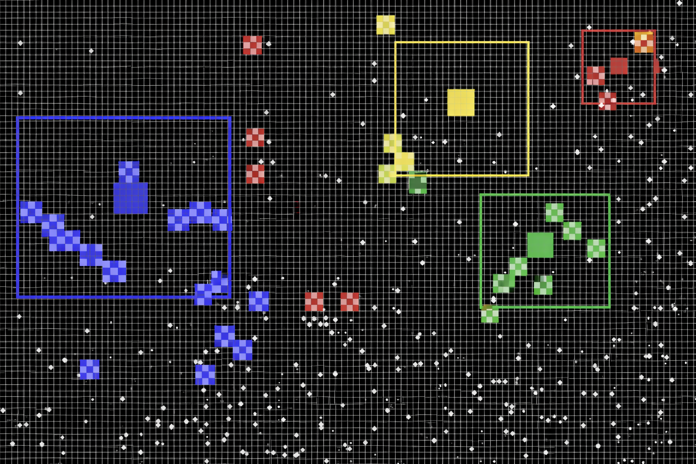

# Ant-colony-simulation-cpp
Discrete-time simulation of competing ant colonies on a 2D grid, developed in C++ as part of the **Tchanz** project.
The goal is to study whether a stable equilibrium can emerge when multiple colonies interact with limited resources.

## 🐜 Project Overview

Each ant colony evolves autonomously in a discrete environment and is composed of different ant roles:

- **Generator** – stores food, consumes resources, and spawns new ants  
- **Collector** – searches for food and brings it back to the colony  
- **Defensor** – protects the colony border  
- **Predator** – attacks enemy collectors and predators  

Food appears randomly over time, colonies grow or shrink depending on resources, and colonies may disappear entirely.

## Key Concepts

- Discrete 2D grid simulation
- Probabilistic events (food generation, births)
- Role-based agent behaviors
- Colony growth constraints and collisions
- MVC-inspired architecture
- GTKmm graphical interface 

